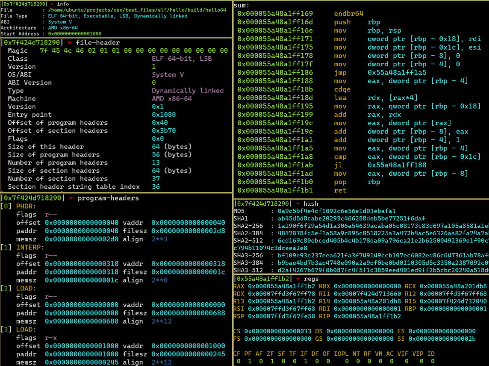

# xex

Reverse engineering tool for ELF and PE. I'm developing this to enhance my reverse engineering and binary exploitation skills.



## Features

- Dump file information (headers, hashes, and more)
- Debugger.

*xex currently only has basic functionality.

## Supported Architecutures

x86, x86_64

<br />

## Install

We can install **xex** from [releases](https://github.com/hideckies/xex/releases).

<br />

## Build

To build the project, clone and build it with `zig`. The Zig version **1.14.0+** is required.

```sh
git clone https://github.com/hideckies/xex
cd xex
zig build
./zig-out/bin/xex --help
```

<br />

## Usage

Execute `xex --help` to display the usage. 

## Dumping File Information

We can dump file information for static analysis.

```sh
# File Information
xex --info example.exe

# All headers
xex --headers example.exe

# File header (ELF)
xex --file-header /bin/ls
# File header (DOS)
xex --file-header example.exe

# Sections
xex --sections example.exe

# Symbol table
xex --symbols /bin/ls
# Dynamic symbol table
xex --dynsymbols /bin/ls
```

### Debugging

xex also has a feature to debug a program.

```sh
xex /bin/ls
xex example.exe

# Specify the arguments for executable.
xex /bin/ls -al /
```

